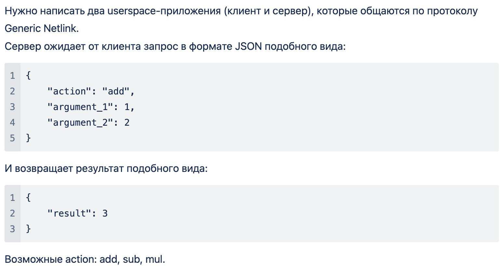

# Задание
Делать можно одно из двух на выбор

1 задание
"Реализовать утилиту, которая осуществляет отправку ping запросов на заданный ipv4 адрес, принимает ответ и печатает MAC адрес отправителя в stdout"

2 задание


Уточнение для задания 2
Реализовать консольную утилиту, которая самостоятельно формирует и отправляет ICMPv4 echo request запросов на заданный позиционным параметром IPv4 адрес, принимает ответ и извлекает из echo reply пакета MAC адрес, печатает этот адрес его в stdout.
При разработке требуется не использовать libstdc++, исключения, RTTI и сторонние библиотеки. Программа должна быть написана под Linux.

## Комментарий к заданию
Делал задание 2. Уточнение к заданию 2 - скорее всего относится к заданию 1, но постарался также выполнить

# Работа
## Серверная часть
Хранится в папке /server. Написана на C
Установка:
Необходимо установить пакет linux-headers вашего дистрибутива

```
cd ./server
make
sudo insmod ndm_server.ko
```

Удаление:

```
sudo rmmod ndm_server.ko
make clean
```

## Клиентская чать
Хранится в папке client. Написана на C++
Установка:
Необходимые пакеты:
nlohmann-json, libnl (см. команды пакетного менеджера вашего дистрибутива)

```
cd ./client
mkdir build
cd build
cmake ..
cmake --build .
```

Запуск:

```
./ndm_client
```